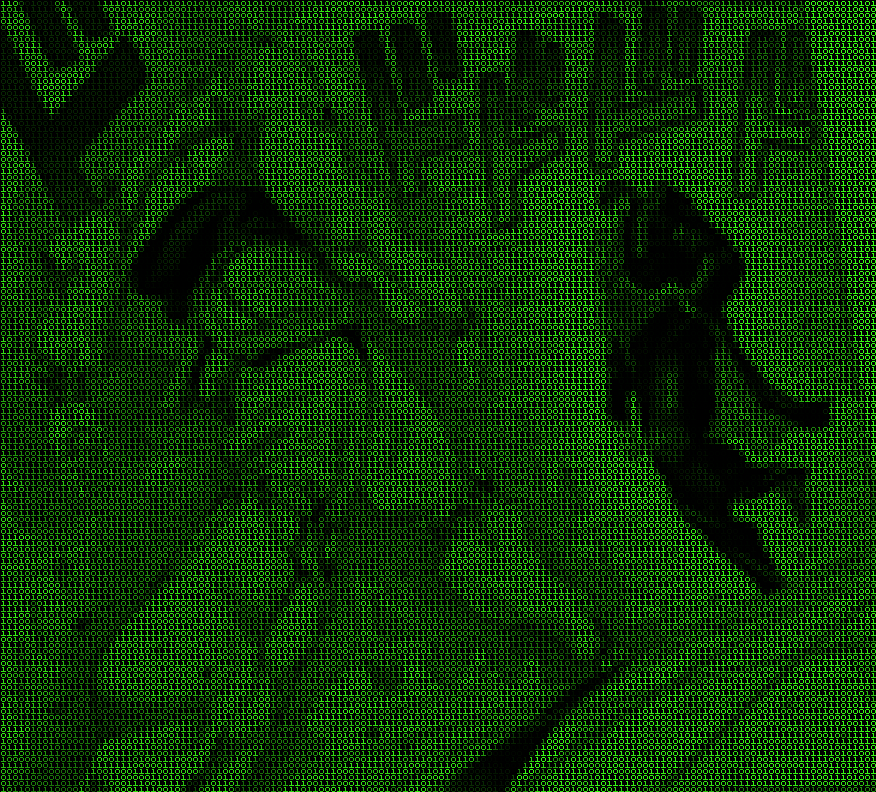

# HackerFX v2

If you've seen [HackerFX](https://github.com/Aniruddha-Deb/HackerFX), this is 
a rewrite in python with a bunch of new features:

- Support for multicoloured images
- Square output characters (no more resizing images before passing them in)
- Hex character support
- Serialize a file and write the bitstream to the image
- Support for videos(requires ffmpeg and ffprobe)

Some examples:





Installation:

1. (Optional) Create a virtual environment using `venv` or `virtualenv`.
2. Run `pip install -r requirements.txt`.
3. Invoke the script with appropriate arguments as per usage given below.   

Usage for images:
```
usage: hackerfx.py [-h] [-x] [-v] [-c COLOR] [-o OUTPUT] [-d DATA] input_image

Binarizes images in the hacker format

positional arguments:
  input_image           Path to input image

optional arguments:
  -h, --help            show this help message and exit
  -x, --hex             Encode Image in Hex
  -v, --video           Encode video
  -c COLOR, --color COLOR
                        RGB Hex Output Image color (default: Hacker Green - 0x39FF14)
  -o OUTPUT, --output OUTPUT
                        Output file name
  -d DATA, --data DATA  Data file to encode into image
```

NOTE: videos need ffmpeg and ffprobe.
